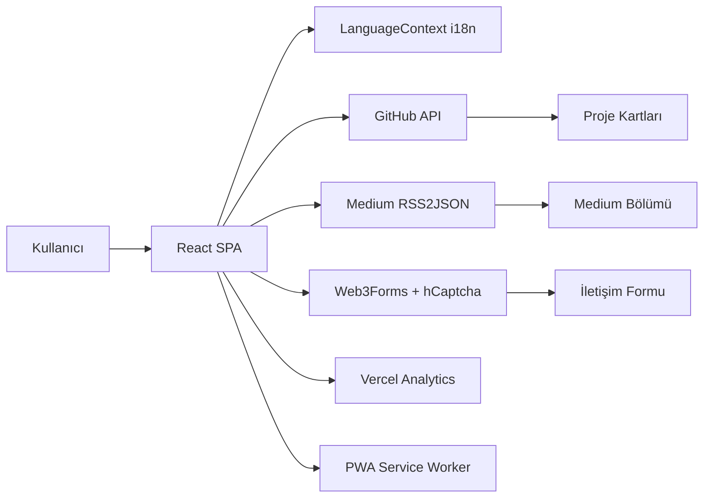

# 🚀 Anıl Bayram — Kişisel Portföy Web Sitesi


**Anıl Bayram**'ın kişisel web sitesi ve dijital portföyü. React 18 ve Vite 8 ile geliştirilmiş, PWA destekli, çok dilli (Türkçe / İngilizce), modern ve yüksek performanslı tek sayfa uygulaması (SPA).

🌐 **Canlı Site:** [an1lbayram-github-io.vercel.app](https://an1lbayram-github-io.vercel.app/)

---

## ✨ Özellikler

### Genel Deneyim
- **Çoklu Dil Desteği (i18n)** — Türkçe ve İngilizce arasında anında geçiş; tercih `localStorage`'da saklanır
- **Karanlık / Aydınlık Mod** — Bootstrap 5 `data-bs-theme` ile tema desteği; tercih kalıcı olarak kaydedilir
- **PWA (Progressive Web App)** — `vite-plugin-pwa` ile offline çalışma ve cihaza yüklenebilme
- **Responsive & Modern UI** — Bootstrap 5, özel CSS animasyonları ve glassmorphism efektleri
- **Özel İmleç (Custom Cursor)** — Marka renkleriyle uyumlu interaktif cursor deneyimi
- **Lazy Loading** — React `Suspense` ile bileşenlerin ihtiyaç anında yüklenmesi
- **Scroll Animasyonları** — Intersection Observer tabanlı fade-up ve card-reveal efektleri

### Bölümler
- **Hero** — TypeWriter animasyonlu rol başlığı, profil fotoğrafları (dark/light tema uyumlu), CV indirme bağlantısı
- **Hakkımda** — Kişisel bilgiler, eğitim geçmişi ve teknik özet
- **Projeler** — GitHub yıldız/fork istatistikleri, kategori filtreleme (Web / Masaüstü / Güvenlik), canlı demo ve GitHub bağlantıları
- **Geliştirme Süreci (Timeline)** — Projelerin kronolojik zaman çizelgesi
- **Medium Yazıları** — RSS2JSON API ile canlı Medium feed entegrasyonu
- **Sertifikalar** — Eğitim ve kurs sertifikaları galerisi
- **Yetkinlikler** — İlerleme çubuklu teknik beceri kartları
- **İletişim** — Web3Forms API, hCaptcha doğrulama ve rate limiting ile güvenli iletişim formu
- **CV / Özgeçmiş** — Yazdırılabilir / PDF indirilebilir tam özgeçmiş görünümü (`#cv` hash routing)

### Entegrasyonlar & Analitik
- **Vercel Analytics** — Ziyaretçi analizi
- **Vercel Speed Insights** — Performans izleme
- **GitHub API** — Proje yıldız ve fork sayıları (1 saatlik cache)
- **Medium RSS Feed** — Teknik yazıların otomatik listelenmesi (12 saatlik cache)
- **Web3Forms** — Sunucusuz iletişim formu gönderimi
- **hCaptcha** — Bot koruması

### SEO & Güvenlik
- **Open Graph & Twitter Card** meta etiketleri
- **JSON-LD Schema.org** (Person) yapılandırılmış veri
- **Sitemap.xml & robots.txt**
- **Content Security Policy** — `vercel.json` ile güvenlik başlıkları
- **XSS Koruması** — Medium feed'de `DOMParser` ile güvenli HTML ayrıştırma
- **Rate Limiting** — İletişim formunda istek sınırlama (3 istek / 5 dakika)

---

## 🛠️ Kullanılan Teknolojiler

### Frontend & Build

| Teknoloji | Versiyon | Kullanım |
|-----------|----------|----------|
| [React](https://react.dev/) | ^18.2.0 | UI framework |
| [Vite](https://vitejs.dev/) | ^8.1.5 | Build aracı ve geliştirme sunucusu |
| [Bootstrap](https://getbootstrap.com/) | 5.3.3 (CDN) | Responsive UI framework |
| [vite-plugin-pwa](https://vite-pwa-org.netlify.app/) | ^1.3.0 | PWA manifest ve service worker |
| [ESLint](https://eslint.org/) | ^8.57.0 | Kod kalitesi ve linting |

### Harici Servisler & API'ler

| Servis | Kullanım |
|--------|----------|
| [Web3Forms](https://web3forms.com/) | İletişim formu gönderimi |
| [hCaptcha](https://www.hcaptcha.com/) | Form bot koruması |
| [GitHub REST API](https://docs.github.com/en/rest) | Proje istatistikleri (stars, forks) |
| [RSS2JSON](https://rss2json.com/) | Medium RSS feed dönüştürme |
| [Vercel Analytics](https://vercel.com/analytics) | Ziyaretçi analizi |
| [Vercel Speed Insights](https://vercel.com/docs/speed-insights) | Web vitals izleme |
| [Google Fonts (Inter)](https://fonts.google.com/specimen/Inter) | Tipografi |

### Tarayıcı API'leri
- **LocalStorage** — Tema, dil ve API cache tercihleri
- **Intersection Observer** — Scroll tabanlı animasyonlar
- **Print API** — CV PDF indirme / yazdırma
- **Service Worker** — PWA offline desteği

### Deployment
- **[Vercel](https://vercel.com/)** — Hosting, CI/CD ve güvenlik başlıkları (`vercel.json`)

---

## 🏗️ Proje Mimarisi

```
Anıl_Bayram/
├── index.html                    # HTML kabuğu (SEO meta, OG tags, JSON-LD Schema)
├── vite.config.js                # Vite + PWA konfigürasyonu
├── vercel.json                   # Güvenlik başlıkları ve CSP
├── package.json
│
├── public/
│   ├── icons/A.ico               # Favicon
│   ├── images/                   # Profil fotoğrafları (light/dark)
│   ├── sitemap.xml               # SEO sitemap
│   └── robots.txt                # Arama motoru yönlendirmesi
│
└── src/
    ├── main.jsx                  # Giriş noktası (PWA SW kaydı, LanguageProvider)
    ├── App.jsx                   # Ana bileşen (tema, lazy loading, analytics)
    ├── index.css                 # Global stiller ve animasyonlar
    ├── cv.css                    # CV / özgeçmiş yazdırma stilleri
    │
    ├── components/
    │   ├── Navbar.jsx            # Navigasyon ve dil değiştirici
    │   ├── Hero.jsx              # Ana banner (TypeWriter, profil fotoğrafı)
    │   ├── About.jsx             # Hakkımda bölümü
    │   ├── Projects.jsx          # Proje kartları (GitHub stats, filtreleme)
    │   ├── Timeline.jsx          # Kronolojik geliştirme süreci
    │   ├── Medium.jsx            # Medium yazıları feed
    │   ├── Certificates.jsx      # Sertifika galerisi
    │   ├── Skills.jsx            # Teknik beceri çubukları
    │   ├── Contact.jsx           # İletişim formu (Web3Forms + hCaptcha)
    │   ├── CV.jsx                # Yazdırılabilir özgeçmiş görünümü
    │   ├── Footer.jsx            # Alt bilgi
    │   ├── CustomCursor.jsx      # Özel imleç efekti
    │   ├── TypeWriter.jsx        # Yazı makinesi animasyonu
    │   ├── Toast.jsx             # Bildirim mesajları
    │   ├── Skeleton.jsx          # Yükleme iskelet kartları
    │   └── ErrorBoundary.jsx     # Hata yakalama sınırı
    │
    ├── context/
    │   └── LanguageContext.jsx   # i18n context (TR/EN, localStorage)
    │
    ├── data/
    │   ├── projects.js           # Proje listesi (Altay, Zenith, FiWi V2, DatHex V2...)
    │   ├── skills.js             # Teknik beceri verileri
    │   ├── certificates.js       # Sertifika verileri
    │   └── medium.js             # Medium fallback verileri
    │
    ├── hooks/
    │   ├── useGitHubStats.js     # GitHub API + cache (1 saat TTL)
    │   ├── useMediumFeed.js      # Medium RSS + cache (12 saat TTL)
    │   ├── useIntersectionObserver.js  # Scroll animasyon hook'u
    │   └── useRateLimit.js       # Form rate limiting hook'u
    │
    └── utils/
        └── translations.js       # TR/EN çeviri tabloları
```

### Veri Akışı



---

## 📦 Öne Çıkan Projeler

Portföyde yer alan başlıca açık kaynak projeler:

| Proje | Açıklama | Demo |
|-------|----------|------|
| **Altay** | Interaktif tarih & kültürel miras haritası (Leaflet, Overpass, Data Fusion) | [altay-liard.vercel.app](https://altay-liard.vercel.app/) |
| **Zenith** | Oyunlaştırılmış verimlilik platformu (Kanban, Pomodoro, XP) | [zenith-pi-nine.vercel.app](https://zenith-pi-nine.vercel.app/) |
| **FiWi V2** | Wi-Fi güvenlik ve ağ izleme web platformu | [fi-wi-v2.vercel.app](https://fi-wi-v2.vercel.app/) |
| **DatHex V2** | Winget tabanlı toplu Windows yazılım güncelleyici | [dat-hex-v2.vercel.app](https://dat-hex-v2.vercel.app/) |
| **GAIA** | OCR destekli soru çözme ve sınav hazırlık platformu | [gaia-plum-one.vercel.app](https://gaia-plum-one.vercel.app/) |
| **DevPulse** | Geliştirici araçları otomatik güncelleyici (Electron) | — |
| **WinKam** | Windows optimizasyon aracı (Python + Electron) | [win-kam.vercel.app](https://win-kam.vercel.app/) |

---

## 🚀 Yerel Geliştirme

### Gereksinimler
- **Node.js** 18+ (önerilen: 20 LTS)
- **npm** 9+

### Kurulum

```bash
# 1. Depoyu klonlayın
git clone https://github.com/an1lbayram/an1lbayram.github.io.git
cd an1lbayram.github.io

# 2. Bağımlılıkları yükleyin
npm install

# 3. Geliştirici sunucusunu başlatın (http://localhost:5173)
npm run dev
```

### Diğer Komutlar

```bash
# Production derlemesi (dist/ klasörüne çıktı)
npm run build

# Production derlemesini yerel önizleme
npm run preview

# ESLint kod kalitesi kontrolü
npm run lint
```

---

## 🌐 Vercel Deployment

1. Projeyi GitHub'a push edin.
2. [Vercel Dashboard](https://vercel.com/dashboard) üzerine gidin.
3. **New Project** butonuna basın ve `an1lbayram.github.io` reposunu seçin.
4. Framework Preset: **Vite**
5. Build Command: `npm run build`
6. Output Directory: `dist`
7. **Deploy** butonuna tıklayın.

`vercel.json` dosyası otomatik olarak güvenlik başlıkları ve Content Security Policy ekler.

---

## 📱 PWA Kurulumu

Portföy sitesi Progressive Web App olarak tasarlanmıştır:

- Tarayıcıda **"Uygulamayı Yükle"** ile ana ekrana eklenebilir
- `manifest.webmanifest` ile standalone mod desteği
- Service Worker ile temel offline erişim (statik asset cache)
- Mobil, tablet ve masaüstünde native uygulama deneyimi

---

## 📄 Lisans

MIT License © 2026 [an1lbayram](https://github.com/an1lbayram)
